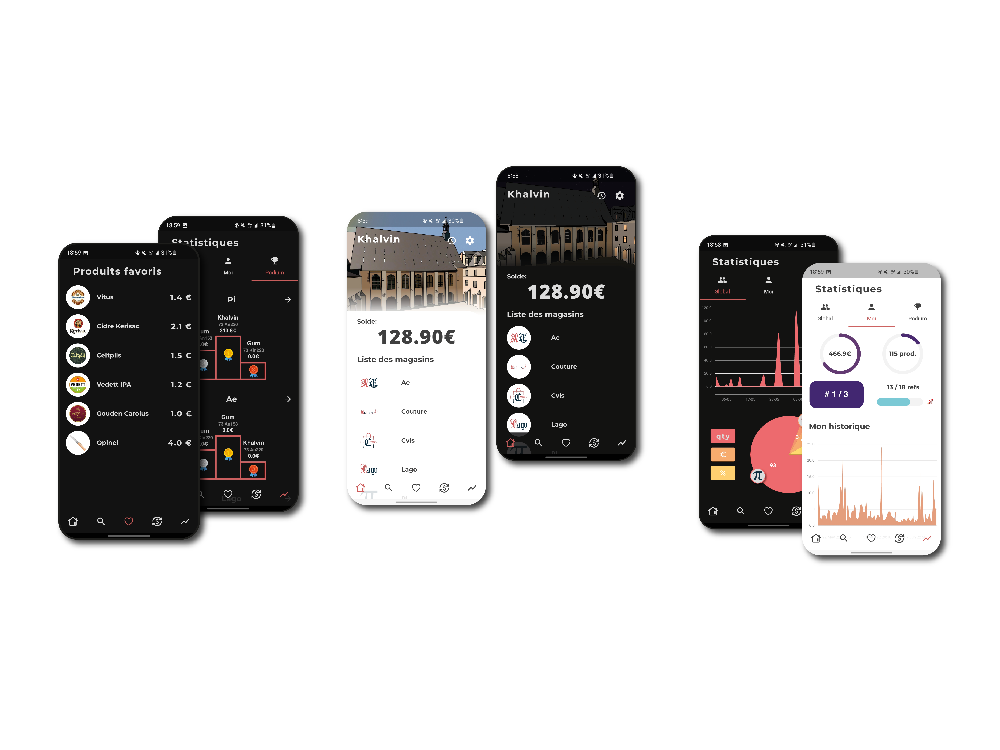

+++
title = "Borgia"
image = "borgiaapp2.png"
type = "gallery"
date = "2024-02-10"

+++

---

*Django, Flutter, Dart, API, HTML, CSS, JavaScript*

---

The [Borgia App](https://github.com/JosueGauthier/borgia_flutter_app) is a software to help you manage your student association. With it, you can sell products, organize events, keep track of your stocks, etc... It will be your best ally to develop your possibilities for your student association.

On this project I worked on the API, Django backend, current web frontend to add features and a brand new mobile frontend made with Flutter.

---

The last [web frontend and backend](https://github.com/JosueGauthier/borgia-serv/tree/sibers2) is today in test phase. I have developed several features on this application such as Excel exports, the invoice manager, an API, a [Grafana visualization tool](https://github.com/JosueGauthier/grafana-borgia) with Loki and Prometheus and I fix many bugs and errors that arise over time.

---

I also fully developped the [current mobile frontend project](https://github.com/JosueGauthier/borgia_flutter_app). I do this developpement with Flutter (Dart language) framework. 

The features are : 

Admin features :

- Possibility for administrators to create, modify, delete products and categories.
- Possibility for administrators to modify existing stores.
- Possibility to set up product sales by operator (an operator with authorizations can sell a product to a user)

User features : 

- A global statistics panel is available with the sales for the whole association
- A panel of statistics of the user's purchases is also available.
- A podium system by store and by product has been added.
- A list of favorites is available taking into account the most purchased products.
- A list of the last purchases made in the application.
- A search system allowing to search users, products, stores, ...

I you want to learn more, go to the [Github repository](https://github.com/JosueGauthier/borgia_flutter_app) of the project.

---

I also realized a new [documentation website](https://josuegauthier.github.io/borgia-sphinx-doc/) for the Borgia project.

